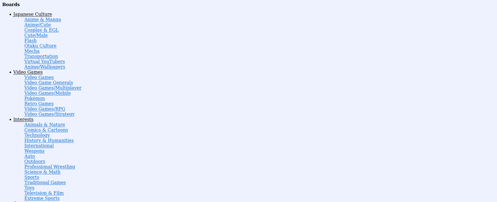
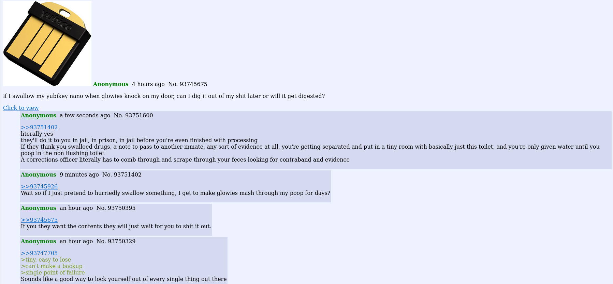
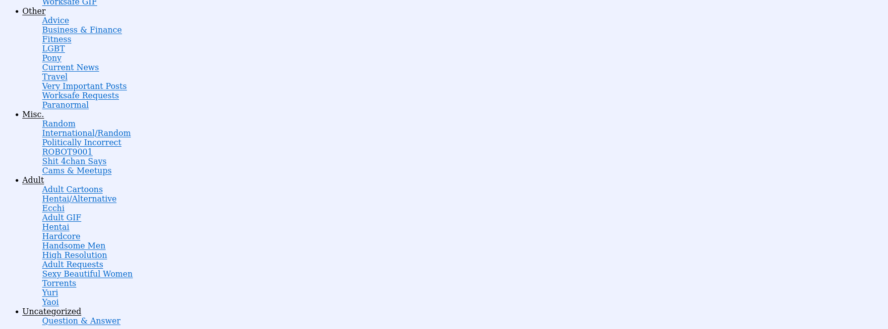

  <h1>PrivacyChan</h1>

  
  
  
  

  <h3>An open source alternative front-end to 4chan (and other imageboards soon).</h3>

  <a href="#">Website (todo)</a>
  &nbsp;•&nbsp;
  <a href="#">Instances list (todo)</a>
  &nbsp;•&nbsp;
  <a href="#">FAQ (todo)</a>
  &nbsp;•&nbsp;
  <a href="#">Documentation (todo)</a>
  &nbsp;•&nbsp;
  <a href="#contribute">Contribute (todo)</a>
  &nbsp;•&nbsp;
  <a href="#">Donate (todo)</a>

## Screenshots

| Homepage                            | Boards                              | Threads                               |
|-------------------------------------|-------------------------------------|---------------------------------------|
|     |       |         |
|     |       |         |

## Features

**User features**
- Lightweight
- No ads
- No tracking
- No JavaScript required

**Upcoming features**
- Create replies/thread
- Data export
- `find.4chan.org` search
- Support for more imageboards

## Quick start

**Using PrivacyChan:**

- [Select a public instance from the list (todo)](#) and start browsing!

**Hosting PrivacyChan:**

- [Follow the installation instructions (todo)](#)

## Documentation

The full documentation can be accessed online at (todo)

<!--### Extensions

We highly recommend the use of [Privacy Redirect](https://github.com/SimonBrazell/privacy-redirect#get),
a browser extension that automatically redirects 4chan URLs to any PrivacyChan instance.

The documentation contains a list of browser extensions that we recommended to use along with PrivacyChan.

You can read more here: (todo)-->

## Contribute

### Code

1.  Fork it ( https://github.com/recanman/privacychan/fork ).
1.  Create your feature branch (`git checkout -b my-new-feature`).
1.  Stage your files (`git add .`).
1.  Commit your changes (`git commit -am 'Add some feature'`).
1.  Push to the branch (`git push origin my-new-feature`).
1.  Create a new pull request ( https://github.com/recanman/privacychan/compare ).

## Liability

We take no responsibility for the use of our tool, or external instances
provided by third parties. We strongly recommend you abide by the valid
official regulations in your country. Furthermore, we refuse liability
for any inappropriate use of PrivacyChan. This tool is provided to you
in the spirit of free, open software.

You may view the LICENSE in which this software is provided to you [here](./LICENSE).

>   16. Limitation of Liability.
>
> IN NO EVENT UNLESS REQUIRED BY APPLICABLE LAW OR AGREED TO IN WRITING
WILL ANY COPYRIGHT HOLDER, OR ANY OTHER PARTY WHO MODIFIES AND/OR CONVEYS
THE PROGRAM AS PERMITTED ABOVE, BE LIABLE TO YOU FOR DAMAGES, INCLUDING ANY
GENERAL, SPECIAL, INCIDENTAL OR CONSEQUENTIAL DAMAGES ARISING OUT OF THE
USE OR INABILITY TO USE THE PROGRAM (INCLUDING BUT NOT LIMITED TO LOSS OF
DATA OR DATA BEING RENDERED INACCURATE OR LOSSES SUSTAINED BY YOU OR THIRD
PARTIES OR A FAILURE OF THE PROGRAM TO OPERATE WITH ANY OTHER PROGRAMS),
EVEN IF SUCH HOLDER OR OTHER PARTY HAS BEEN ADVISED OF THE POSSIBILITY OF
SUCH DAMAGES.